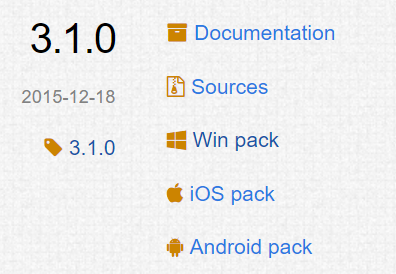

# Install & Setting

## Install

먼저, OpenCV를 사용하기 위해 **설치를 시작**하겠습니다.

설치 URL : [https://opencv.org/releases.html](https://opencv.org/releases.html)

해당 URL에서 원하는 version을 Download합니다.

저의 경우, **Opencv 3.1.0 Release version**을 Window10에서 사용하였습니다.

위와 같이 C:\ 하위에 바로 **압축 해제**를 합니다.

## Setting 1

이제 설치는 모두 완료했고, OpenCV 사용을 위한 **설정을 시작**하겠습니다.

Visual Studio 프로젝트 생성 시 왼쪽 \[Visual C++\] -&gt; \[Windows 데스크톱\]에서 

\[Windows 데스크톱 마법사\]를 통해 **프로젝트를 생성**합니다. 

\(다른 설정으로 프로젝트 생성시, 미리 컴파일된 헤더도 같이 추가되기 때문에 빈 프로젝트로 생성하기 위함입니다.\)

다음과 같이 **빈 프로젝트를 생성**합니다.

\[소스파일\] -&gt; \[추가\] -&gt; \[새 항목\] 에서 **소스 파일을 생성**합니다. 

다음과 같이 **솔루션 플렛폼을 x64**로 설정해줍니다.

이제부터는 C:\에 압축 해제한 경우에 적용됩니다.

\(자신이 opencv를 설치한 경로에서 찾아 설정하시면 됩니다.\)

## Setting 2

\[프로젝트\] -&gt; \[프로젝트 속성\] -&gt; \[구성 속성\] -&gt; \[C/C++\] -&gt; \[일반\] 탭에서

**\[추가 포함 디렉터리\]**에 다음과 같은 경로를 추가 합니다.

> C:\opencv\bulid\include

## Setting 3

\[프로젝트\] -&gt; \[프로젝트 속성\] -&gt; \[구성 속성\] -&gt; \[링\] -&gt; \[일반\] 탭에서

**\[추가 라이브러리 디렉터리\]**에 다음과 같은 경로를 추가합니다.

> C:\opencv\build\x64\vc14\lib

## Setting 4

\[프로젝트\] -&gt; \[프로젝트 속성\] -&gt; \[구성 속성\] -&gt; \[링커\] -&gt; \[입력\] 탭에서

**\[추가 종속성\]** -&gt; \[편집\]에 다음과 같이 추가합니다.

\(여기서, 310은 자신이 설치한 버전에 맞게 적으시면 됩니다.\)

> opencv\_world310d.lib

## Setting 5

\[프로젝트\] -&gt; \[프로젝트 속성\] -&gt; \[구성 속성\] -&gt; \[디버깅\] 탭에서

**\[환경\]**에 다음과 같이 추가합니다.

> PATH=C:\opencv\build\x64\vc14\bin; %PATH%;

자! 이제, opencv를 사용하기 위한 설치와 설정 과정을 모두 마쳤습니다!

앞으로는 적용해 볼 차례입니다!

